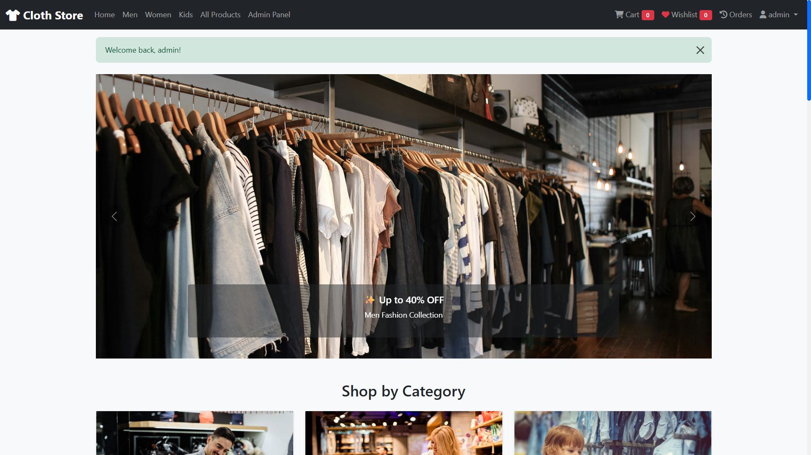
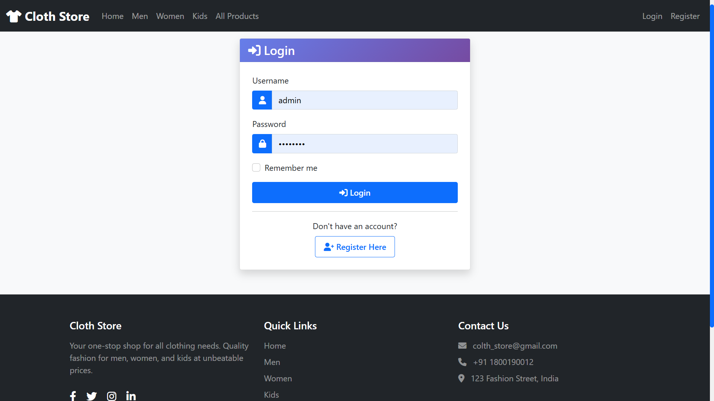
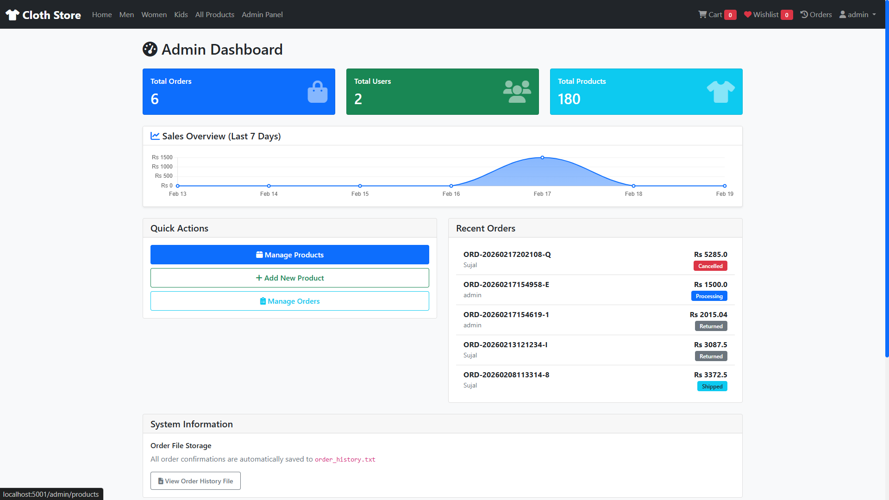
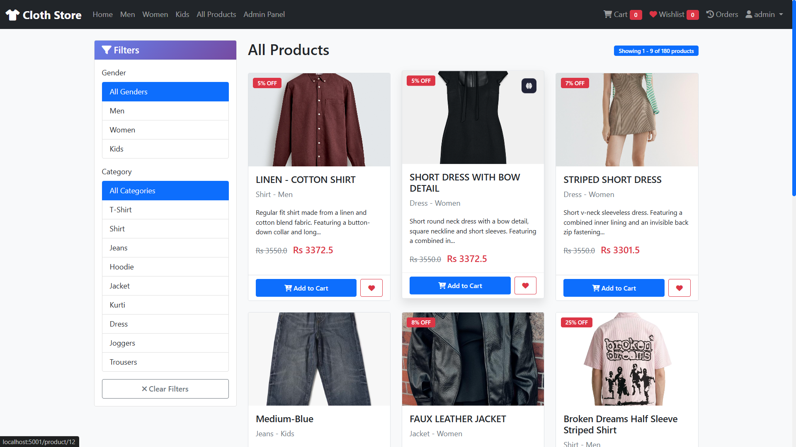
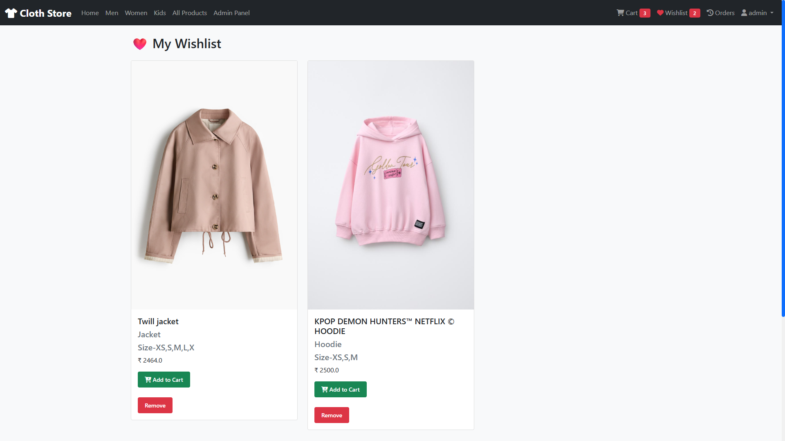
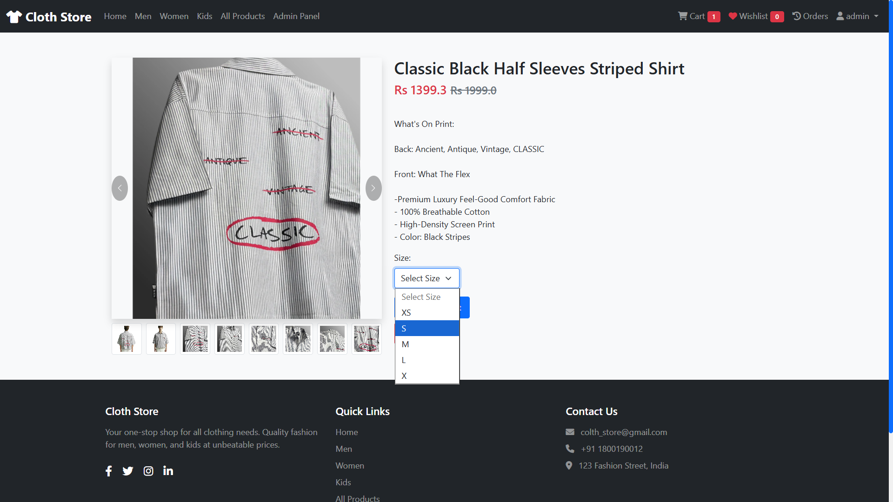
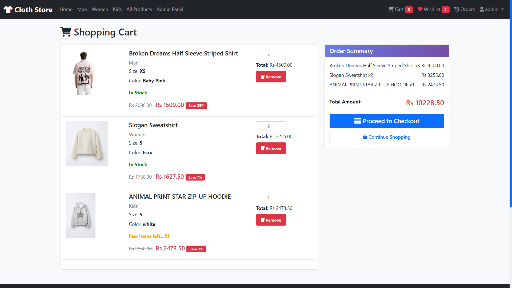
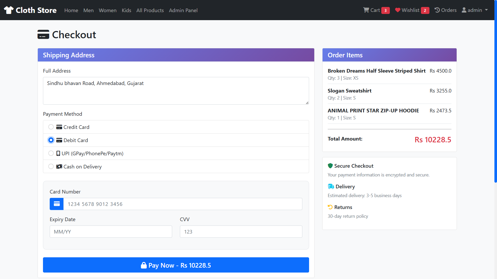
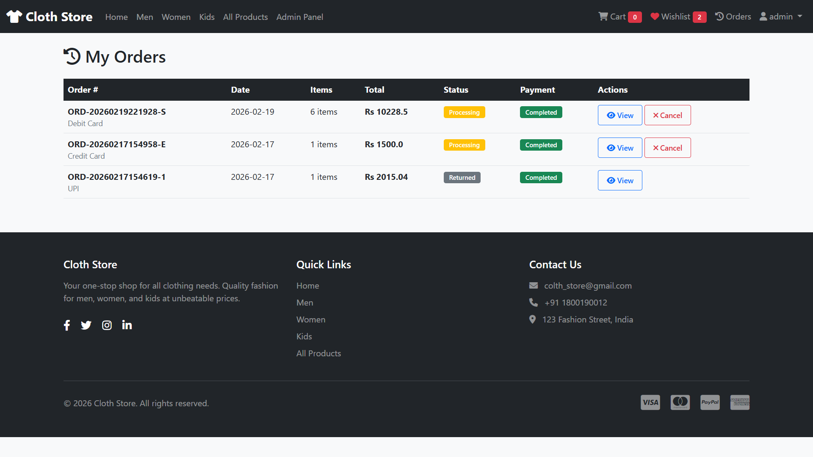

# Online Clothing Store Management System

A Python Flask-based web application for managing an online clothing store.

## Features
- User authentication
- Product management
- Shopping cart
- Admin panel

## Technologies Used
- Python
- Flask
- HTML, CSS, Bootstrap
- SQLite

## Screenshots

### Home Page


### Login Page


### Admin Dashboard


### All Product


### Wishlist Page


### Order Page


### Cart Page


### Order Checkout


### Order History


## How to Run
```bash
pip install -r requirements.txt
python app.py
